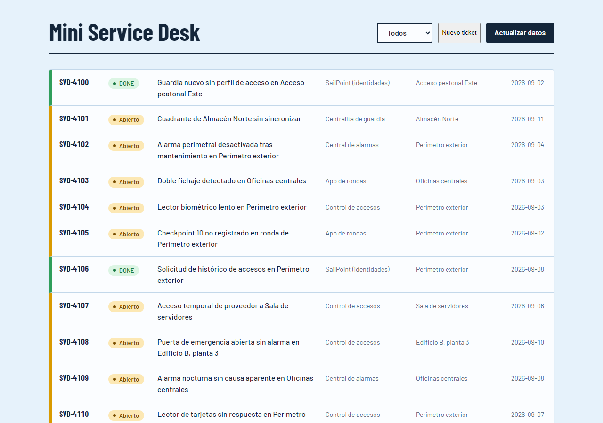
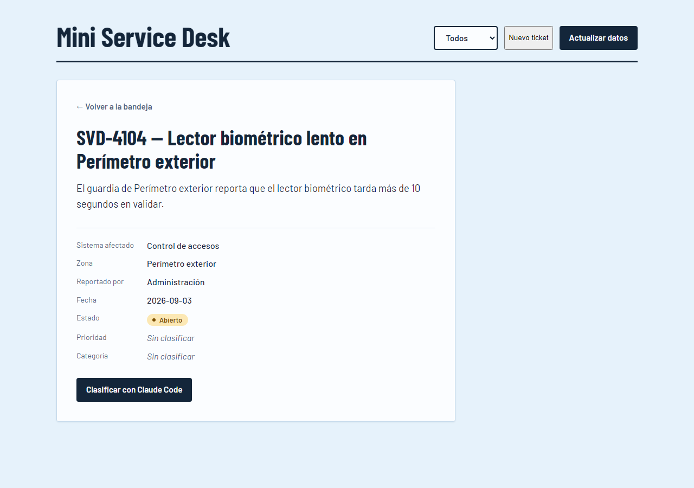
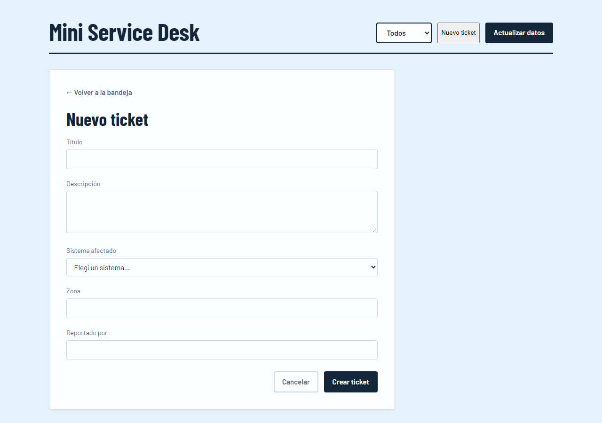
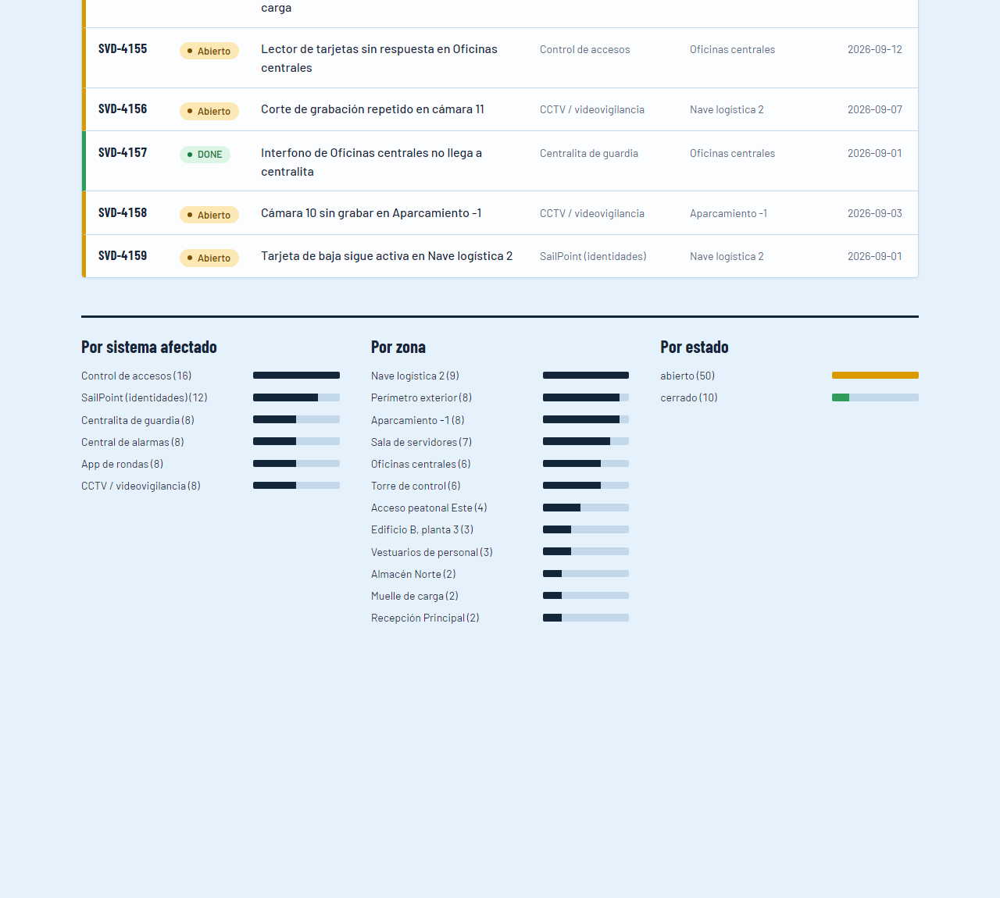

# Diseño — Fase 2 (Sesión 3)

Este documento ya no es el wireframe de la Fase 2: refleja lo que terminó implementado en la
Fase 3, sobre `main`. Las capturas son de la app real corriendo contra `data/tickets.json`
(artículo 7 de la constitución: nada de datos inventados). Decisiones y criterios de
aceptación, en [`docs/spec.md`](spec.md).

## Concepto visual

"Libro de novedades de un puesto de control": hoja blanca sobre fondo celeste, tinta azul
marino, un acento ámbar para lo que sigue abierto y uno verde para lo resuelto.

- **Tipografía:** [Barlow Condensed](https://fonts.google.com/specimen/Barlow+Condensed) para
  títulos, [Barlow](https://fonts.google.com/specimen/Barlow) para el resto — cargadas de
  Google Fonts, con fallback a la fuente del sistema si no hay conexión.
- **Color de fondo:** `#e6f2fb` (celeste suave).
- **Color de estado — el mismo en toda la app** (insignia, raya lateral de cada fila, y barra
  "Por estado" del panel de métricas):
  - `abierto`: ámbar uniforme, sin variación por ticket.
  - `cerrado`: se muestra como **"DONE"** en verde.
- **Color de prioridad** (ficha de detalle, una vez clasificado): Crítica en rojo, Alta en
  ámbar, Media en azul, Baja en gris — mismo patrón visual que el estado, una insignia por
  valor.

## Pantallas

### 1. Bandeja

Lista los 60 tickets de `data/tickets.json` en una sola hoja, con filtro por estado (Todos /
Abiertos / Cerrados) y el panel de métricas debajo. Botones "Nuevo ticket" y "Actualizar
datos" en la cabecera.



### 2. Ficha de ticket

Al hacer click en una fila se abre el detalle completo (los 8 campos del registro), con
prioridad/categoría si ya fue clasificado o "Sin clasificar" si no. El botón "Clasificar con
Claude Code" solo aparece si el ticket no tiene `prioridad` todavía.



### 3. Nuevo ticket

Formulario de alta (Feature 4 de `spec.md`): título, descripción, sistema afectado (los 6
valores ya usados como `sistema_afectado` en el dataset), zona y reportado por. Al enviarlo,
el ticket se guarda en `localStorage` del navegador — nunca en `data/tickets.json` — y aparece
de inmediato en la bandeja. No se puede editar ni clasificar después.



### 4. Panel de métricas

Vive dentro de la misma pantalla de la bandeja, no es una vista aparte. Tres grupos de barras
— por sistema afectado, por zona, por estado — que se recalculan al cambiar el filtro o
actualizar los datos. Las barras "Por estado" usan el mismo ámbar/verde que las insignias.



## Flujo de navegación

Sin routing por hash ni por URL (decisión de `spec.md`, YAGNI para el alcance del proyecto):
`app.js` guarda `state.vista` (`'bandeja'` | `'ficha'` | `'formulario'`) y vuelve a renderizar
sin recargar la página. No hay deep-link a un ticket ni botón "atrás" del navegador para la
ficha o el formulario.

```
Bandeja ──(click en una fila)──> Ficha ──(← Volver a la bandeja)──> Bandeja
Bandeja ──(Nuevo ticket)───────> Formulario ──(Cancelar / Crear ticket)──> Bandeja
```
